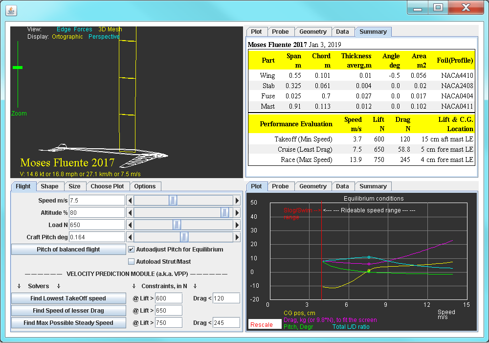
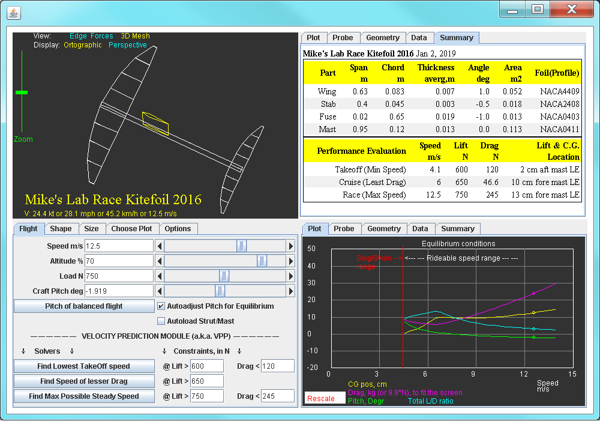
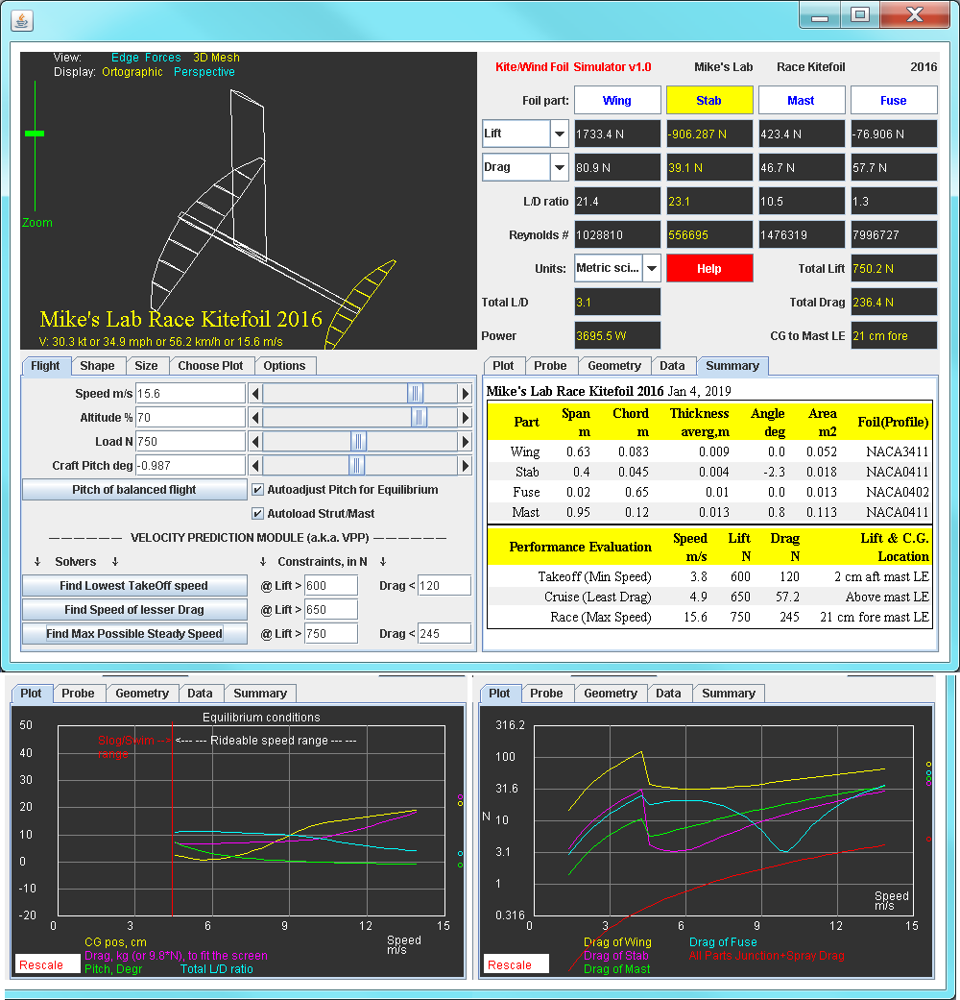
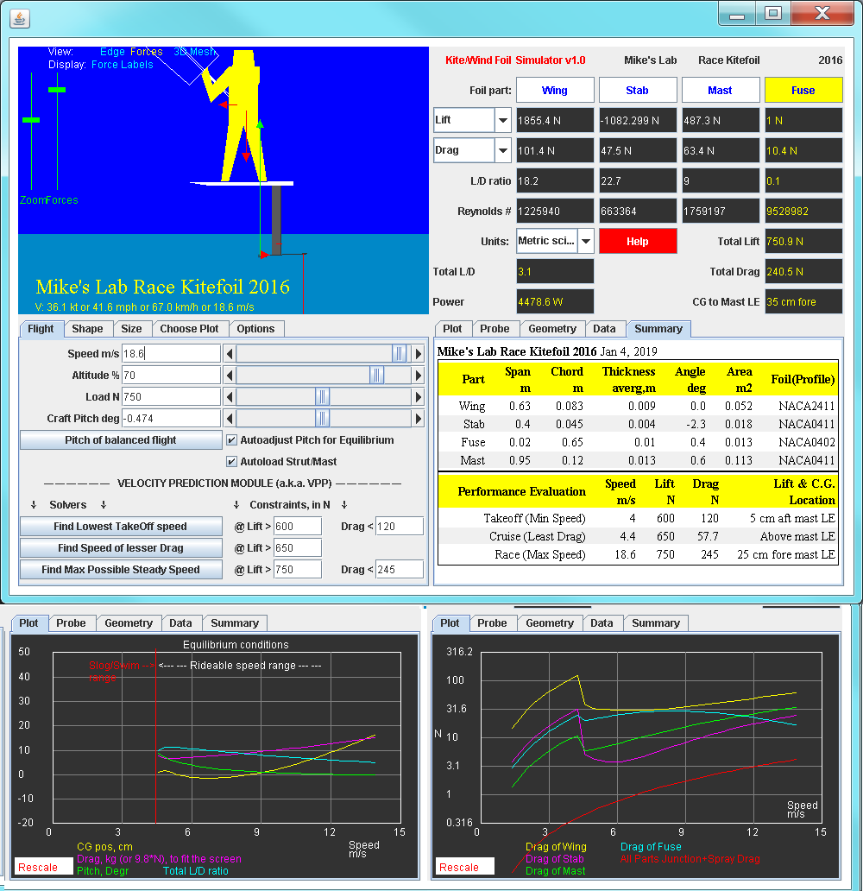
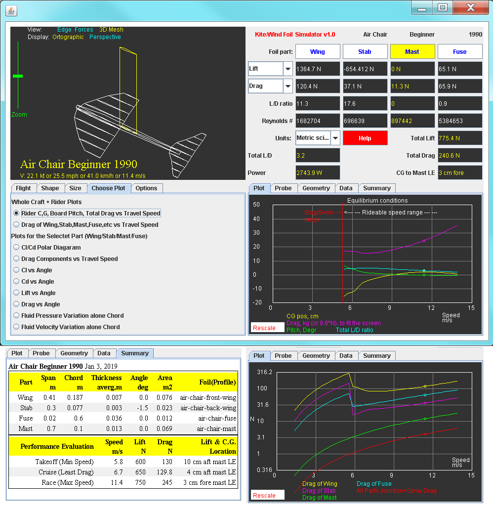
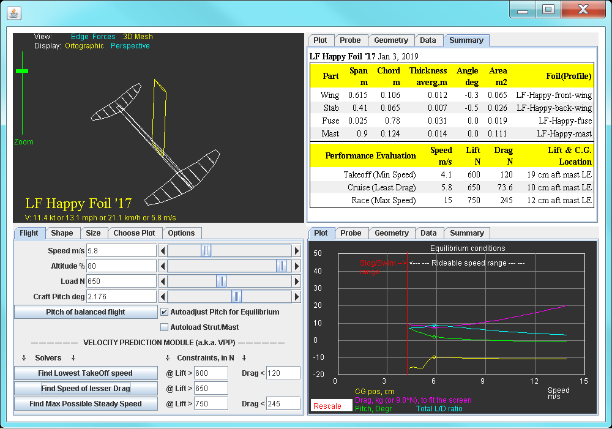
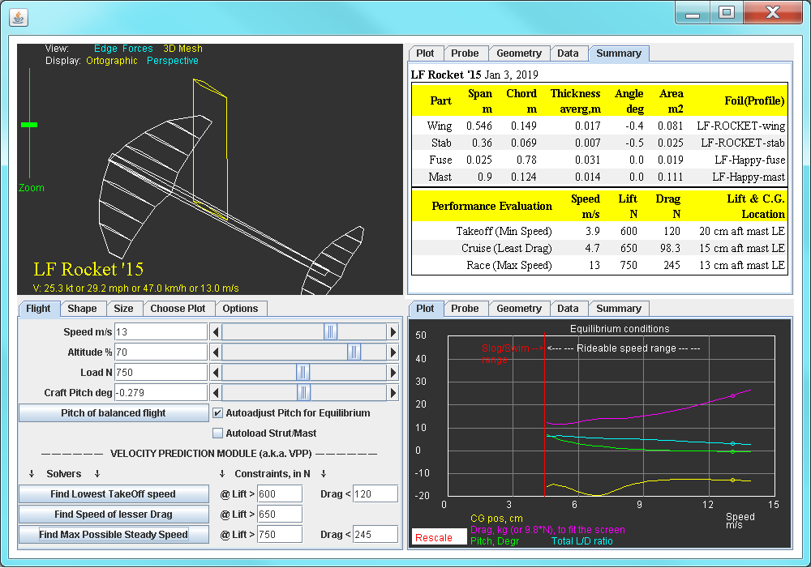

# Kite Foils

This folder provides a few html files defining some kite foils. A few of these come with exact measurements and profile outlines, the rest  are not. 

A few screenshots with the results shown below. To save space,
the "Summary" tab  on most screenshots was placed over the Results panel,
so that the Plot tab can also be shown.

## Moses Fluente 2017 

## Sroka Freeride 2016

## MHL Lift 2016

Notes: Stab camber and AoA *guestimated* but appear close to real.  

## Mike's Lab  Race Foil 2016

Notes. Decalage was measured, by my request, by ML team rider Sonny S
and appears to be 2.4, that is, WingAoA- StabAoA = 2.4. Because I did not know the exact shape of MLRF'16  wing and stab profiles, nor I knew the cambers in %, but I knew the foil is fast, I decided to optimize the incidence angles and camber values for top speed assuming NACA4 series foils.  Additionally, because the wing has very sharp pointing tips, I bumped up the tip performance factor to 1. The result is above. Notice that the result is with Mast auto-loading  checkbox selected, which means it is for real conditions. The result is that with these settings the top sped is 37kts. The rider needs be somewhat forward (26cm fore mast LE),
CG can be locked much better with slight positive camber added to the stab. The current value is 0 (NACA0411). 

The above tuning gives impressive top speed. In comparison, naive settings give the result below...  

A big factor in foil performance at given speed is fuselage contribution: drag of fuselage is lowest when it travels horizontally. A simplified foil tuning/optimization routine is, therefore, to (1) run drag optimization for given/desired speed (2) check fuse angle, if not 0, then (3) either correct both wing and stab AoA by that value, or, alternatively, change Fuse AoA correspondingly. Repeat until fuse travels strictly horizontally, that is, CraftPitch - FuseAoA = 0. Detailed tuning instructions are to be provided, with screenshots. 

Here is another variant of optimized MLRF setup with the same decalage of 2.4 degrees.  This time, front foil has smaller  camber - NACA2411 - and no incidence (AoA to fuse = 0), but the fuselage angle is 0.5 degrees:

## Air Chair WaterSki Hydrofoi

Notes: The incidence angles are measured by the author, not guesstimated. 
Cl/Cd data derived from actual airfoil profiles.  These profiles were never meant
to be optimized and are draggy - Air Chair is originally boat-tow watercraft, but was used successfully for kiting and windowing.   For windfoiling, it is necessary to extend the fuselage forward, so that the wing can be mounted 90-100mm forward. 

## Liquid Force Happy Foil 2017

Notes: Wing and stab profiles and incidences  are actual  measurements by Ken Poulton.

## Liquid Force Rocket 2015

Note: Cl/Cd data derived from actual airfoil profiles.  Stab with 0.5 AoA. Ken's measurements for stab incidence: stock: -0.05, with   Ken's shim (rides much better, still rider's CG needs be *wa-a-ay* back):  -0.55

> Written with [StackEdit](https://stackedit.io/).
